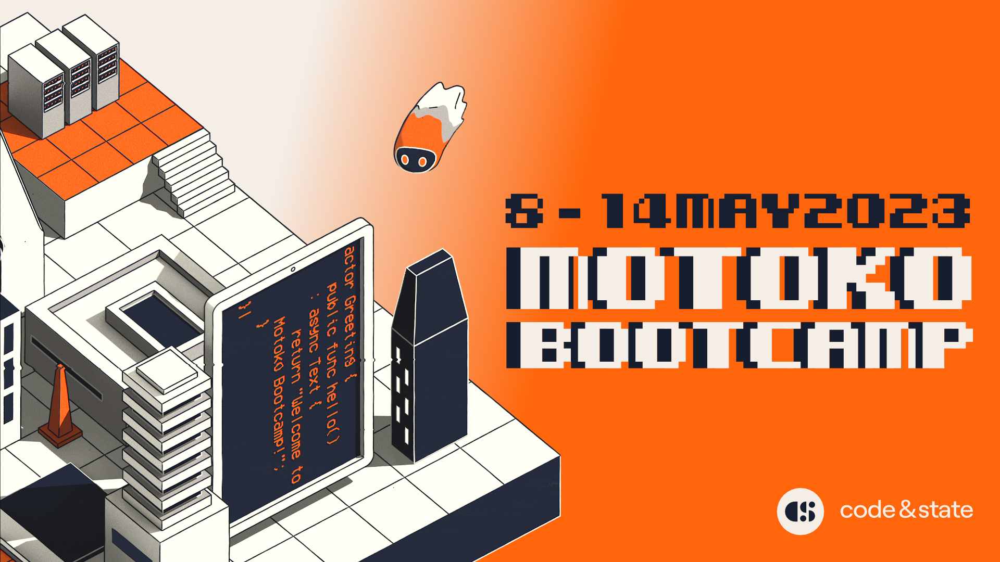
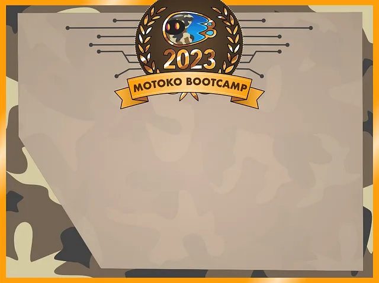

# Motoko Bootcamp: starter edition - 7 days to get started on the Internet Computer 🏁

  
 

### Participate in Motoko Bootcamp: Starter edition. You can follow online from anywhere in the world or join one of [community basecamp](https://discord.gg/FWQszm86cj). 

⚠️ This event is over, but you can still use the content at your own path and follow the program. Make sure to watch [the dedicated video](). 

<i> La traducción al español puedes encontrarla [aquí](./spanish/README.MD). </i>
## Introduction
Welcome to **Motoko Bootcamp: Starter edition** — the most amazing free one-week program to learn how to develop on the Internet Computer. 
7 days is all it should take to change your life. Learn Motoko, get started on the Internet Computer and meet others builders - **all in one week**.  

No prior experience is required — you’ll learn everything from how the ICP works to programming in Motoko.  

With engaging lectures, hands-on projects, and a supportive community, you’ll gain a deep understanding of the limitless potential of the Internet Computer. Technical help is available 24/7 on Discord.

  

Upon completion, you'll be awarded a diploma, unlocking the door to an exclusive community and amazing full-time job opportunities within the vibrant ICP ecosystem! 
 
---
We're thrilled to introduce the Internet Computer, a remarkable innovation combining cryptography, math, computer science, and blockchain technology.
Despite the incredible technology we believe that the true value of a network lies in a passionate community, and during this Bootcamp, you'll learn from diverse developer mentors and contributors that are active member of the community, giving their time to make this event possible.

Our goal is to transmit both technical knowledge and enthusiasm for the Internet Computer as a force for a better future. We believe in its potential to create a fairer, more hopeful world, and hope the insights and connections you make this week contribute to that goal.

## How to get started? 🏁

### Step 0: Make sure you are ready to go ✅
- You should join the [Motoko Bootcamp Discord](https://discord.gg/JS9g2ahtDs).
- You should have `dfx` installed on your machine, check [this tutorial](https://www.youtube.com/watch?v=DTDP7WYU07w) if you need help to install it.

### Step 1: Register on the Bootcamp dashboard.
1. Connect to: [Motoko Bootcamp Dashboard](https://24ytc-bqaaa-aaaan-qdl7q-cai.ic0.app/)

  

2. Make sure to **Login**.
3. Register

  

- Your handle corresponds to your name - feel free to choose whatever you want.
- Your principal ID should correspond to the identity you are planning to use for the week, to obtain your principal id run : `dfx identity get-principal` in your terminal. Once set, it cannot be changed make sure to choose the principal corresponding to the identity you are planning to use.
- Check the box if a you are a Spanish speaker.
### Step 2: Find your team.
Once you are registered, go into the **Profile** section.

  

This where you will your team. Then you'll need to go into Discord and access the **Team** channel.

  

React to the message with the emoji corresponding to your team. You'll automatically receive the role corresponding to your team.
### Step 3: Go to Day 1
For each day, you will find a dedicated guide - those guides will be your companions to navigate through all the available resources and challenges.
- [Click to access to Day 1️⃣ ](./days/day-1/README.MD) 

### Step 4: Submit your canister once you are done.
1. Assuming you have deployed the canister corresponding to project of day 1. Note the **canister ID**.
2. Connect to: [Motoko Bootcamp Dashboard](https://24ytc-bqaaa-aaaan-qdl7q-cai.ic0.app/) - go the **Submit Code** section.
3. Add your canister id and select "**Day 1**". 
4. Click on submit. If your submission is valid, you'll see the update in **Submission Status**.

  

### Step 5: Complete all other days, join the lectures and have fun with all of us!

- [Day 2️⃣](./days/day-2/README.MD) 
- [Day 3️⃣](./days/day-3/README.MD) 
- [Day 4️⃣](./days/day-4/README.MD) 
- [Day 5️⃣](./days/day-5/README.MD) 

## Overview
Motoko Bootcamp is an online event, you can follow the entire week online or join other enthusiasts in a [community basecamp](https://discord.gg/FWQszm86cj) to follow the week together.

### 🎉 Kick Off Ceremony
Make sure to register for the Kick-Off Ceremony 👉 [Register](https://zoom.us/webinar/register/WN_lFvM-NU4QIWP3-xq6JNSag).
### 🗓️ Calendar 
Make sure to add the calendar to follow the week 👉 [Add the Motoko Bootcamp calendar](https://calendar.google.com/calendar/embed?src=c_6aa8747b96696ec2475587b7d256d56eec735ddca3f2c5cebb32093e0f4667bc%40group.calendar.google.com).

> Events should appear in your time zone. If they don't, add the calendar to your personal agenda by clicking "+Google Calendar" in the bottom right to update it to your time zone.

### 📜 Daily guides
The Bootcamps is divided in 6 days. (Sunday is for rest 😴)
For each day, you will find a dedicated guide - those guides will be your companions to navigate through all the available resources and challenges.
- [Day 1️⃣](./days/day-1/README.MD) 
- [Day 2️⃣](./days/day-2/README.MD) 
- [Day 3️⃣](./days/day-3/README.MD) 
- [Day 4️⃣](./days/day-4/README.MD) 
- [Day 5️⃣](./days/day-5/README.MD) 
- Day 6️⃣ [To be released] 
### 🏗️ Projects 
Projects will help you build confidence and practical skills. You will be provided with clear instructions and a starting codebase to complete. 
You will work on 5 different projects:
- [The Calculator ➕](./days/day-1/project/README.MD)
- [The Homework diary 📔](./days/day-2/project/README.MD)
- [The Student wall 🎨](./days/day-3/project/README.MD)
- [MotoCoin 🪙](./days//day-4/project/README.MD)
- [The Verifier 👨‍🏫](./days/day-5/project/README.MD)

> Once completed, submit your project through the dashboard. It will check if you've met the requirements.
### 👨‍🏫 Lectures
A lecture is approximately one hour long and covers a technical subject. It is presented by one of the Motoko Bootcamp mentor. 

> Lectures are held live on Zoom, but don't worry if you can't make it - they'll also be recorded and uploaded to YouTube for you to watch later. Just check out the list of all lectures on [the dedicated page](./lectures/LECTURES.MD).
### 🎙️ Presentation
Presentations are a crucial component of the Motoko Bootcamp program, and attending them is highly recommended. Unlike lectures, which focus on the core technical knowledge of Motoko, presentations provide an opportunity to learn about various tools and opportunities available to Motoko developers.

> As for lectures, presentations are held live on Zoom, but  don't worry if you can't make it - they'll also be recorded and uploaded to YouTube for you to watch later. Just check out the list of all presentations on [the dedicated page](./lectures/LECTURES#presentations-🎙️).
### 🐥 Mentorship 
You have access to mentorship sessions, where you can troubleshoot any challenges you're facing and get answers to all your questions directly from the experts. These sessions are open to everyone in the Bootcamp, so make sure you take advantage of this incredible opportunity.

### 🤹 Activities 
In addition to the main program, we've got some awesome activities lined up for you, like networking and gaming sessions! These are totally optional, but we've planned them to add a little extra excitement to your week. So come and join the fun! 

> Activities will be held on Discord. You can consult the [list of all activities on the dedicated page](./lectures/LECTURES.MD#activities-🤹).
###  🫂 Teams 
At Motoko Bootcamp, we believe in the power the collaborative. That's why you will be put into teams and each team will have a score. The score of the team depends on the progress of **all** members. 
Although you'll be working on your project independently, we want to ensure you have others to share your journey with and help keep you motivated.
We encourage you to schedule a daily meeting with your team on the Discord voice channel to stay in touch and discuss any challenges you face. **Remember, you're not alone on this journey!**

### 📞 Assistance 
This event is being run by volunteers and we have limited resources, we won't be able to answer all questions at all times considering that we have hundreds of students, please understand this fact and make sure to follow all instructions in the order provided.  

When you need help, follow these steps in this order:

1. Dig into the list of resources, documentation and channels on Discord. Most likely the answer you need will be in here if you dig enough, and the more practice you get navigating the more effective and self-sufficient you'll be able to be as an Internet Computer developer.
2. Ask your team for help on Discord: collaboration is the key to the succcess.
3. Post in #ask-questions channel on Discord and ask your question by creating a new topic. Make sure your issue hasn't already been answered in another topic.
If you decide to create a new topic, please provide as much information as possible:
    - When did you encounter the issue?
    - What is the exact error message?
    - What have you already tried to deal with the problem?
    - Provide some screenshots to illustrate your request.
4. Join the next mentorship sessions.
5. You can ask for a Motoko Angel to assist you.

> 🚫 Do not spam the main channel of Discord with your issue, and avoid directly DM-ing organizers (expect Motoko-angels). Disruptive behavior that hinders the learning of other students will put you at risk of getting kicked out of the Bootcamp. We've never had to do this before, don't be the first.

### 👼 Motoko Angel
Our Motoko-Angels are a squad of awesome, super knowledgeable past graduates from the Motoko Bootcamp who have volunteered some of their time to save the week for any student in need!
They're like your personal superheroes, here to guide you through the challenges that are waiting for you during the week 🦸

> You can consult the list of all Motoko Angel in [the dedicated channel](https://discord.gg/nRxUph88fX).
### 🎓 Graduation
To graduate, you need to complete the 5 projects and submit them through the dashboard. 🧑‍🎓
To graduate **with honors**, you additionally need [to complete the final project](./days/day-6/project/README.md).

### 🎁 Prizes
The prize pool is worth **200 ICP (around 1000$)**.

By completing this week, not only will you receive the prestigious **Motoko Bootcamp Diploma**, but if you participate in the final project, you'll also have the opportunity to compete for additional prizes:

- 1st place: The absolute best submission will seize a generous 100 ICP reward.
- 2nd place: The second-best entry will claim an impressive 50 ICP prize.
- 3rd place: The third-place contender will be rewarded with a notable 25 ICP.

The remaining portion of the prize pool will be distributed as follows:
- 20 ICP for the best video submission of the week - see #video-contest for more information.
- 5 ICP for the best meme of the week - see #meme-contest for more information.

> To compete for prizes, you first need to complete the 5 projects and validate them through the dashboard.
### 🏕️ Community basecamp
Interested in connecting with other enthusiasts? Join students in your area to follow the week and work on challenges, lectures, and projects together. [Click here to join a community basecamp](https://discord.gg/JS9g2ahtDs).

  

 Your Motoko adventure starts in your own backyard 🏕️</> 

### 👦 Join the community
- [Join our Discord](https://discord.gg/JS9g2ahtDs).
- Follow [Motoko Bootcamp](https://twitter.com/MotokoSchool) and [Code & State](https://twitter.com/codeandstate) on Twitter. 
- Check the [dedicated website](https://motokobootcamp.com/).

### 📝 Feedback
Motoko Bootcamp is constantly evolving, and we strive to make each edition better than the last.  Whether you are a student, mentor, contributor, or joining online or in person, we value your feedback and suggestions for improvements.   

You can post your thoughts, ideas, and feedback in the dedicated feedback channel by [clicking here](https://discord.gg/x6uSTzDS5c).  

> If you prefer to have a more personal conversation, feel free to send [me](https://twitter.com/seb_icp) a direct message. I am always eager to receive feedback and chat about new ideas and suggestions.

## 🤝 Partners 
- [Code & State](https://twitter.com/codeandstate), a ICP-focused venture studio, is the organization making this event possible. 
- [TalentDB](https://twitter.com/talentdb_icp), a recruiting agency specialized for the Internet Computer will assist graduates in finding employment opportunities within the start-ups of the ecosystem.
- [Inspire3](https://twitter.com/inspire3_icp), is hosting a community gathering in Germany. 🇩🇪
- [Inside Dark Studio](https://twitter.com/idarkstudio) is hosting a community gathering in Argentina. 🇦🇷
## 🚀 Let's f♾️cking build 

  

