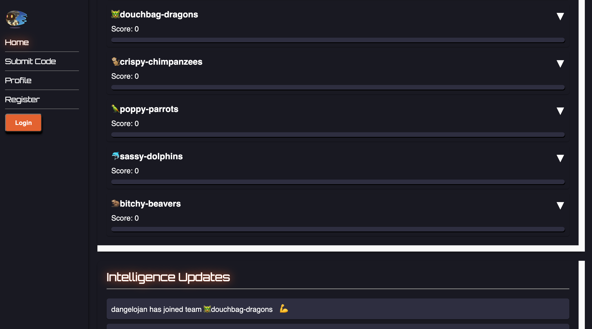
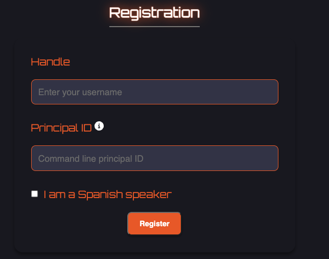
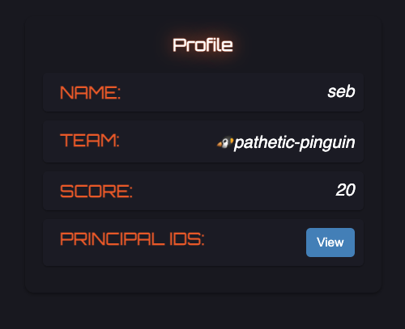
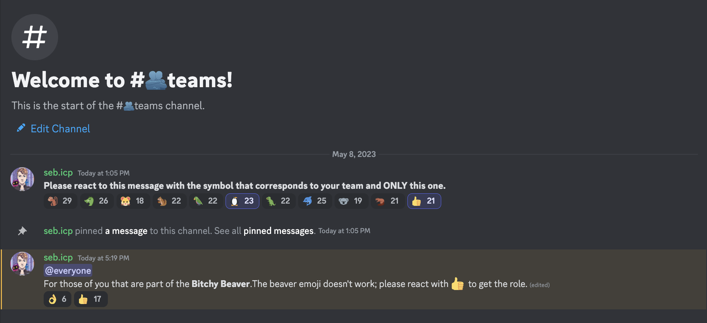
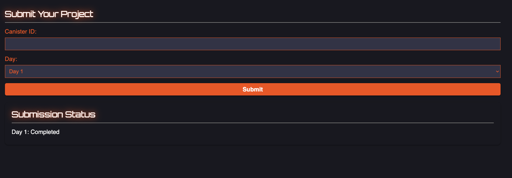

# Motoko Bootcamp: starter edition - 7 days to get started on the Internet Computer 🏁
<i> La traducción al español puedes encontrarla [aquí](./spanish/README.MD). </i>

## Introduction
Welcome to **Motoko Bootcamp: Starter edition** — the most amazing free program to learn how to develop on the Internet Computer. 

7 days is all it should take to change your life. Learn Motoko, get started on the Internet Computer and meet others builders - **all in one week**.  

No prior experience with the Internet Computer is required — you’ll learn everything from how the ICP works to programming in Motoko.  

With engaging lectures, hands-on projects, and a supportive community, you’ll gain a deep understanding of the limitless potential of the Internet Computer. 

Upon completion, you'll be awarded a diploma, unlocking the door to an exclusive community and amazing full-time job opportunities within our vibrant ICP ecosystem! 

> Motoko Starter was an event held in May 2023. Although the event is over, you can still benefit from the content in this repository to progress on your own path and successfully complete the program!

To graduate from the program, you need to complete 6 projects and submit them using our graduation form. To assist you in this process, we provide comprehensive guides and lectures. 

## How to get started? 🙋
### Step 0: Make sure you are ready to go ✅
- You should join the [Motoko Bootcamp Discord](https://discord.gg/JS9g2ahtDs).
- You should have `dfx` installed on your machine, check [this tutorial](https://www.youtube.com/watch?v=DTDP7WYU07w) if you need help to install it.
### Step 1: Register on the Bootcamp dashboard.
1. Connect to: [Motoko Bootcamp Dashboard](https://24ytc-bqaaa-aaaan-qdl7q-cai.ic0.app/)

  

2. Make sure to **Login**.
3. Register

  

- Your handle corresponds to your name - feel free to choose whatever you want.
- Your principal ID should correspond to the identity you are planning to use for the week, to obtain your principal id run : `dfx identity get-principal` in your terminal. Once set, it cannot be changed make sure to choose the principal corresponding to the identity you are planning to use.
- Check the box if a you are a Spanish speaker.
### Step 2: Find your team.
Once you are registered, go into the **Profile** section.

  

This where you will your team. Then you'll need to go into Discord and access the **Team** channel.

  

React to the message with the emoji corresponding to your team. You'll automatically receive the role corresponding to your team.
### Step 3: Go to Day 1
For each day, you will find a dedicated guide - those guides will be your companions to navigate through all the available resources and challenges.
- [Click to access to Day 1️⃣ ](./days/day-1/README.MD) 

### Step 4: Submit your canister once you are done.
1. Assuming you have deployed the canister corresponding to project of day 1. Note the **canister ID**.
2. Connect to: [Motoko Bootcamp Dashboard](https://24ytc-bqaaa-aaaan-qdl7q-cai.ic0.app/) - go the **Submit Code** section.
3. Add your canister id and select "**Day 1**". 
4. Click on submit. If your submission is valid, you'll see the update in **Submission Status**.

  

### Step 5: Complete all other days, follow the lectures and have fun!

- [Day 2️⃣](./days/day-2/README.MD) 
- [Day 3️⃣](./days/day-3/README.MD) 
- [Day 4️⃣](./days/day-4/README.MD) 
- [Day 5️⃣](./days/day-5/README.MD) 
- [Day 6️⃣](./days/day-6/README.MD)

## How to navigate the repository? 🧭
This repository contains a variety of resources, each serving a specific purpose. Here is a comprehensive list of the resources available, along with a brief explanation of each:

### 📜 Daily guides
The Bootcamps is divided in 6 days. (Sunday is for rest 😴)
For each day, you will find a dedicated guide - those guides will be your companions to navigate through all the available resources and challenges.
- [Day 1️⃣](./days/day-1/README.MD) 
- [Day 2️⃣](./days/day-2/README.MD) 
- [Day 3️⃣](./days/day-3/README.MD) 
- [Day 4️⃣](./days/day-4/README.MD) 
- [Day 5️⃣](./days/day-5/README.MD) 
- [Day 6️⃣](./dats/day-6/README.MD)

### 🏗️ Projects 
Projects will help you build confidence and practical skills. You will be provided with clear instructions and a starting codebase to complete. 
You will work on 6 different projects:
- [The Calculator ➕](./days/day-1/project/README.MD)
- [The Homework diary 📔](./days/day-2/project/README.MD)
- [The Student wall 🎨](./days/day-3/project/README.MD)
- [MotoCoin 🪙](./days//day-4/project/README.MD)
- [The Verifier 👨‍🏫](./days/day-5/project/README.MD)
- [The dApp 🚀](./days/day-6/project/README.MD)

> Once completed, submit your project through the dashboard (expect for the last project). It will check if you've met the requirements. 
### 👨‍🏫 Lectures
A lecture is approximately one hour long and covers a technical subject. It is was presneted by one of the Motoko Bootcamp mentor. 

> Lectures were originally held live on Zoom, but they have been recorded and uploaded to YouTube. Just check out the list of all lectures on [the dedicated page](./lectures/LECTURES.MD).

## How to graduate? 🎓
### Step 1: Complete and validate projects 1-5 throught the Motoko Bootcamp dashboard.
Those projects will be automatically verified by the dashboard.
### Step 2: Complete project 6 (the dApp)
For this project, it can't be submitted through the dashboard, so you'll need to include all relevants in the graduation form:
- URL for the frontend of the dApp.
- Canister ID for the backend.
- GitHub URL of the repository (publicly viewable).
### Step 3: Complete the graduation form
Complete the graduation form: https://forms.gle/rmiYABHd7ojPLgJZ8   
Our team will review your submission within 2 weeks, and let you know if you've graduated! 

## 👦 Join the community
- [Join our Discord](https://discord.gg/JS9g2ahtDs).
- Follow [Motoko Bootcamp](https://twitter.com/MotokoSchool) and [Code & State](https://twitter.com/codeandstate) on Twitter. 
- Check the [dedicated website](https://motokobootcamp.com/).

## 📝 Feedback
Motoko Bootcamp is constantly evolving, and we strive to make each edition better than the last.  Whether you are a student, mentor, contributor, or joining online or in person, we value your feedback and suggestions for improvements.   

You can post your thoughts, ideas, and feedback in the dedicated feedback channel by [clicking here](https://discord.gg/x6uSTzDS5c).  

> If you prefer to have a more personal conversation, feel free to send [me](https://twitter.com/seb_icp) a direct message. I am always eager to receive feedback and chat about new ideas and suggestions.

## 🤝 Partners 
- [Code & State](https://twitter.com/codeandstate), a ICP-focused venture studio, is the organization making this event possible. 
- [TalentDB](https://twitter.com/talentdb_icp), a recruiting agency specialized for the Internet Computer will assist graduates in finding employment opportunities within the start-ups of the ecosystem.
- [Inspire3](https://twitter.com/inspire3_icp), hosted a community gathering in Germany. 🇩🇪
- [Inside Dark Studio](https://twitter.com/idarkstudio) hosted a community gathering in Argentina. 🇦🇷

## 🚀 Let's f♾️cking build 

  

