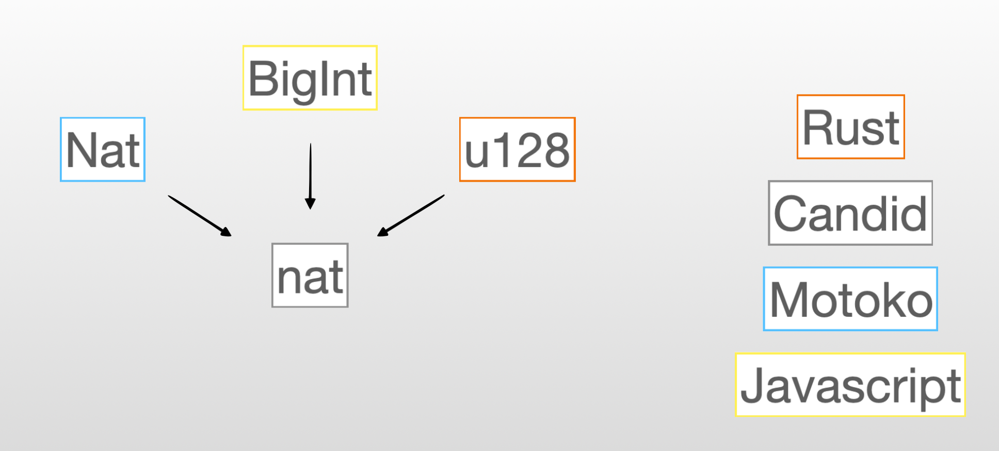

# Chapter 4: Candid the language of the Internet Computer.
## Why do we need Candid? 
Let's imagine the following situation:

- We are writing a canister in **Motoko** and we have defined a value `n` of type Nat.
```motoko
let n : Nat = 5;
```
- We know  another canister that exposes a public function `square` that returns the `square` of the number provided - this canister is written in **Rust**.

We want to compute the square of our value `n`, but we are very lazy and we don't want to implement the `square` function in the **Motoko** canister, instead we want to make use of the already existing function in the **Rust** canister. That's possible and it will make use of **intercanister-calls** (a more advanced concept that we will see in more details in another lesson).

The problem is the following: `n` is of type `Nat` and the `square` function only accepts value of type `u128`. But, in **Motoko**, the type `u128` doesn't exist! It it is like trying to communicate in Spanish with someone that speaks Chinese.

<p align="center">  </p>
<p align="center"> Communication can be hard sometimes...</p>

> Composing services (i.e canisters) written in different languages is central to the vision of the **Internet Computer**. How do we solve this fundamental communication issue between canisters?

## What is an IDL?
We need to introduce an **Interface Description Language (IDL)**. An interface description language (**IDL**) is a generic term for a language that lets a program written in one language communicate with another program written in another unknown language.

**Candid** is an **IDL** describing the public services deployed in canisters on the **Internet Computer**. The Candid interface allows inter-operation between services, and between services and frontends, independently of the programming language used. <br/>

Candid solves the problem we raised earlier by enabling a mapping between types in different languages. 

<p align="center">  </p>
## Candid file (.did)
A **Candid** file is a file with the .did extension - we can define the interface of the `square` canister with the following .did file:
```candid
service : {
  square: (nat) -> (nat) query;
}
```

In this case, our service has a unique function named `square`. This function takes a `nat` and returns a `nat`. Notice that we also used the keyword `query`.

<p align="center">  </p>
<p align="center"> Candid is the common ground for all canisters to solve their misunderstanding!</p>

The `nat` used here is not the same as the `Nat` type in **Motoko**, or any type in **Rust**. If the `square` canister was written in Motoko the Candid interface would be exactly the same. The description of the service is independent of the language it was written in - this is key!

Candid solves the problem we've raised earlier by enabling a mapping between types in different languages.

<p align="center">  </p>

The type `u128` will be converted to `nat` which is then converted to `Nat` in the **Motoko** canister. This makes it possible to write the following code:

```motoko
actor {
    let n : Nat = 5;

    //We define the other canister in our own code.
    let rustActor : actor = {
        square : Nat -> Nat;    // We use Motoko types here  
    };

    public func getSquareOfN() : async Nat {
        await rustActor.square(n);  // This is how you can call another canister - pretty cool, right?! 
    };

};
```

[TODO: ADD RECAP INFORMATION]

> Candid is sometimes called "**the language of the Internet Computer**" as it how canisters communicate with each other. You will rarely have to write Candid but it's important to understand why Candid was created, how to read it, and how it works since you'll encounter Candid files in the projects you will work on. 
