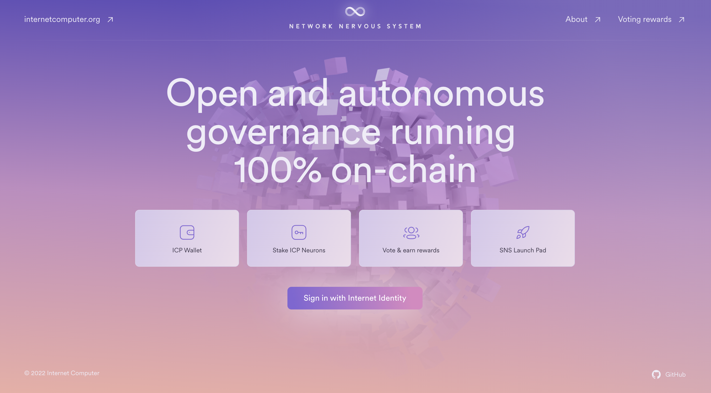

## Appendix 4: Network Nervous System (NNS)

  

 Home page of the NNS

The most developed DAO operating on the IC (so far!) is the one that manages the network itself. This DAO is called the **Network Nervous System** and it is responsible for making decisions about the future of the network, coordinating various parties, and arranging the network's structure.

Typically, when a blockchain needs to be upgraded, it takes a few weeks or months to complete the process. This requires node operators to upgrade their software. If some node operators refuse to upgrade or if a group of them install a different version, it can result in a "fork," where the blockchain splits into two separate chains - creating two completely different network of lower sizes.

  

 The 2017 Bitcoin fork split the community, with some advocating for increased block size, leading to the creation of two versions: the original Bitcoin and Bitcoin Cash with new rules

On the Internet Computer, upgrades are voted on by the **Network Nervous System** (NNS). If the upgrades are accepted, the software of the nodes is directly upgraded, which mitigates the possibility of a fork. 
 
The NNS is governed by a liquid democracy, in which ICP holders stake their ICPs to create neurons. 
The voting power of these neurons is based on :
- The amount of staked ICPs.
- The duration of the staking.
- The age of the neuron.

  

The proposals that can be voted on by the **NNS** (**Network Nervous System**) are grouped into different categories, such as:

- 💸 Network economics: proposals related to determining the rewards paid to node operators.
- 👨‍💼 Node administration: proposals related to administering node machines, including upgrading or configuring the operating system, virtual machine framework, or node replica software.
- 🌏 Subnet management: proposals related to administering network subnets, such as creating new subnets, adding and removing subnet nodes, or splitting subnets.
- 🧑‍⚖️ Governance: proposals related to administering governance, such as motions and configuring certain parameters.

To learn more about the incredible power of the NNS, check out the [Internet Computer Wiki](https://wiki.internetcomputer.org/wiki/Network_Nervous_System).

The NNS is constitued of **different canisters**. Each canister is deployed on the same subnet which is also called the [NNS subnet](https://dashboard.internetcomputer.org/subnet/tdb26-jop6k-aogll-7ltgs-eruif-6kk7m-qpktf-gdiqx-mxtrf-vb5e6-eqe).

  

 Overview of the canisters running the NNS

-  🏦 [Ledger](https://icscan.io/canister/ryjl3-tyaaa-aaaaa-aaaba-cai): This canister is responsible for controlling the balance of ICPs for all users, processing transactions, minting & burning ICPs.
- 🏛️ [Governance](https://icscan.io/canister/rrkah-fqaaa-aaaaa-aaaaq-cai): This canister is responsible for keeping track of neurons, proposals & votes and ultimately taking actions when the proposals are accepted or rejected.
- 🏭[Registry](https://icscan.io/canister/rwlgt-iiaaa-aaaaa-aaaaa-cai): This canister is responsible for storing and modifying the configuration of the Internet Computer (Adding or removing nodes, adding or removing subnets, storing public keys of subnets, assign nodes to subnets, storing canister ids and which subnet they belong to....)
- 🪟 [NNS-UI](https://icscan.io/canister/qoctq-giaaa-aaaaa-aaaea-cai): This canister is responsible for storing the official interface that gives users a way to interact with the 3 others canisters. 

> **NNS-UI** is the main interface for interacting with the **NNS**, but other user-friendly interfaces can be created. The community has already created an [interface that allows proposal creation without using a terminal](https://nnsproposal.icp.xyz/), a missing feature in the main **NNS-UI**.

As we seen with the example of the **NNS** - building a **DAO** can involve deploying and managing multiple canisters.
