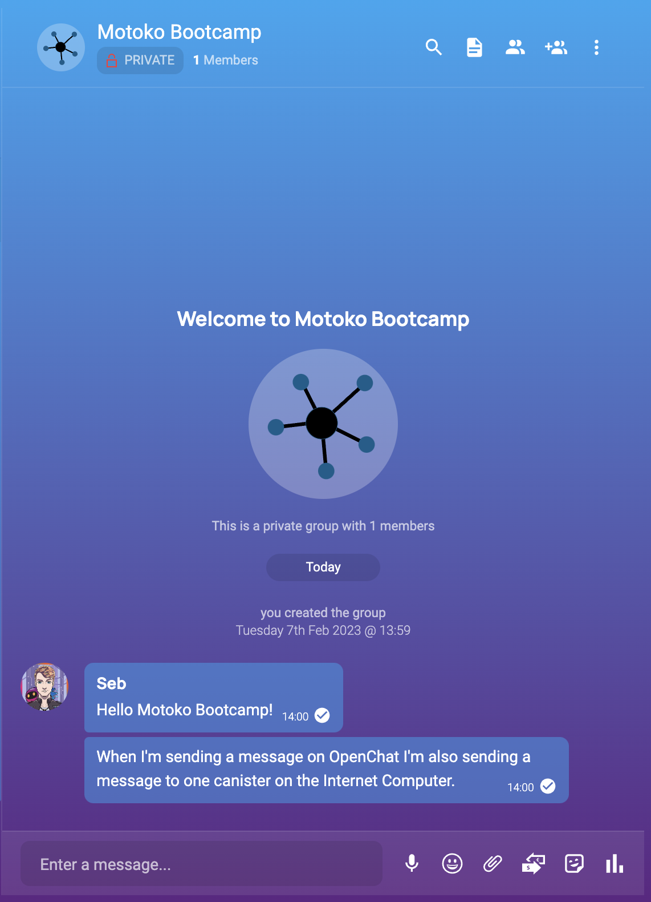
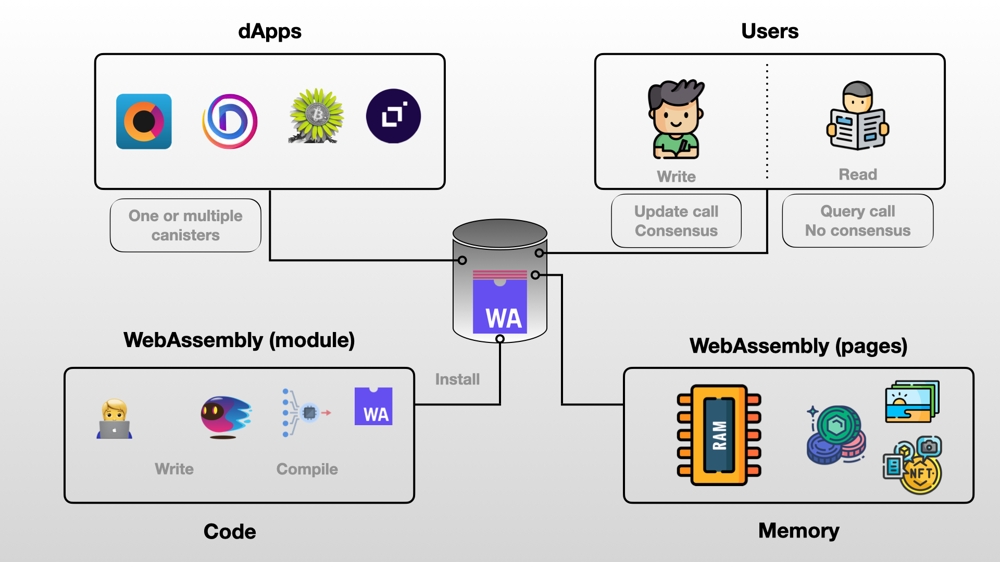
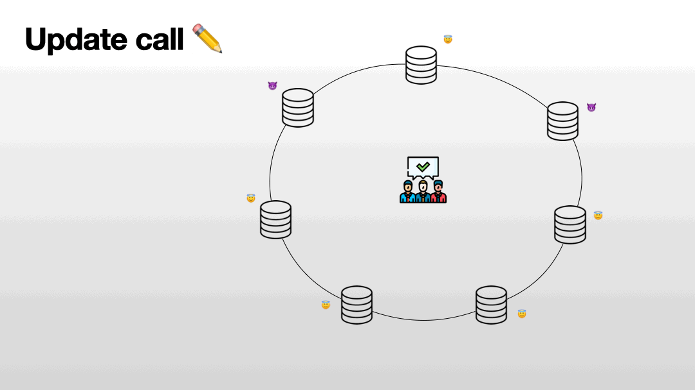
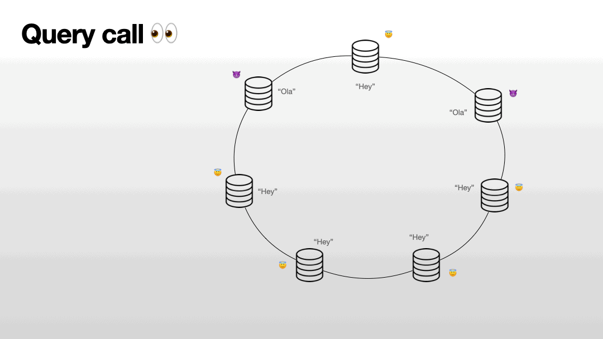

# Chapter 1: Fundamental concepts.
##  What is a canister?
There is one word you absolutely need to master from this entire week. Are you ready for it? 
It's... 🥁... **CANISTER**! 

The Internet Computer is a platform that hosts a large number of applications, all of those applications run smoothly within special containers called **canisters**. 

- The Internet Computer is responsible for smoothly and safely run all the canisters deployed on the platform in parallel.
- Developers build applications by writing the source code for those canisters. An application can be built into one or several canisters depending on the architecture.
- Users will interact with applications by sending messages to canisters. This happens whenever you use an application on the Internet Computer and interact with it - a few examples of such interactions are:
    - When you post on a social network.
    - When you send a token to another address.
    - When you buy or sell an NFT.
    - When you read content on a website hosted on the Internet Computer.
    - And way more...

<p align="center">  </p>
<p align="center"> OpenChat is a decentralized messaging application built on the Internet Computer. </p>

## WebAssembly
Before we move on to Motoko - we actually need to explain another term: **WebAssembly**.

<p align="center">  </p>
<p align="center"> Overview of a canister.</p>

If we zoom inside, a canister is composed of:
- A **WebAssembly module** which is a piece of compiled code from languages such as Rust or Motoko. This is the code that is installed in the canister and is ultimately running. 
- A **WebAssembly memory** - also called memory pages. This is where the state of the canister is stored and files are stored (photos, videos, tokens...). Code runs by the WebAssembly module will modify the memory.

<p align="center">  </p>

<p align="center"> What is <b> WebAssembly </b>? <p>
WebAssembly is a low-level binary format for executing code in multiples environments (browsers, cloud platform, smart devices, virtual machine..). The main benefits of using WebAssembly are, 

- **WebAssembly** supports code written in multiple languages (C, C++, Rust, Motoko) making it a versatile solution for developers.
- **WebAssembly** code is portable and can run on almost any device. You write it once and you can run it everywhere!
<p align="center">  </p>
<p align="center"> Write once and deploy on any platform. </p>

- **WebAssembly** is fast. It's a language that is very close to machine language and has been optimised for speed and performance. You can use it for creating complex and intensive applications (Games, simulations, graphic)!
- **WebAssembly** provides a secure execution environment, by putting the code in a special area called a sandbox. The sandbox makes sure that the program is only able to do things and access resources that have been granted access to and doesn't allow it to access sensitive informaiton. This helps a lot when trying to write secure code or for users to make sure they won't get harmed by the code running on their machine!

The only problem with **WebAssembly** is that it's a low-level language and it provides very little abstraction, making it difficult to use for writing complex applications like dApps (decentralized applications). 

## The Motoko language
<p align="center">  </p>

That's why the [DFINITY Foundation](https://dfinity.org/) has introduced a new language called **Motoko**, which is a programming language specifically designed for creating decentralized applications (dApps) on the Internet Computer. Since Motoko code can directly be compiled into **WebAssembly**, it is an incredible language to build on the Internet Computer. Motoko is a high-level language, that is easy to use. You write in Motoko and then it compiles for you in WebAssembly.

<p align="center">  </p>
<p align="center"> In Motoko the code is spun, Into WebAssembly it does run.</p>

> It's worth noting that WebAssembly, was co-designed by [Andreas Rossberg](https://github.com/rossberg), who joined the DFINITY Foundation early in 2017 to work on its canister smart contract execution environment and is also the original designer of the Motoko language. The standard is maintained by the [World Wide Web Consortium](https://www.w3.org/). 

In the following example, here is a `factorial` function, illustrated in **Motoko** and **WebAssembly**.
Don't stress out if you don't understand anything - that's normal:

<table align="center">
  <tr>
    <th> Motoko </th>
    <th>WebAssembly (Binary)</th>
  </tr>
<td><pre>
func factorial(n : Nat) : Nat {
    if(n == 0) {
        return 1
    } else {
        return factorial(n - 1);
    }
};
</pre></td>

<td><pre>
20 00
42 00
51
04 7e
42 01
05
20 00
20 00
42 01
7d
10 00
7e
0b
</pre></td>
</tr>
</table>
<p align="center"> What do you think? Does writing this function seem easier with <b> Motoko </b>?  </p>

A Motoko file is a file with the extension `.mo`.

<p align="center">  </p>

**Motoko** is a high-level language such as **JavaScript** or **Python**. It is generally considered easier to learn than a lower level language like **Rust** or **C**. 

---
<i> Motoko has a cool mascot that has been intensively used and modified in the community, for all sort of purposes!
So not only will you be able to build cutting-edge decentralized applications with Motoko, but you'll also have the coolest logo in the game. Don't believe us? Just check out the [Motoko NFT market](https://entrepot.app/marketplace/motoko) and see for yourself. </i>

## The actor model.
If you open a Motoko file, there is a high probability that the first word that you will read is `actor`:
```
actor {

    /// CODE

};
````
An **actor** is how a canister is represented and abstracted in **Motoko**. This terms comes from the [Actor model](https://en.wikipedia.org/wiki/Actor_model) which is a way to write computer programs that can handle many tasks at the same time. It does this by treating **actors** as the basic building blocks of a program. <br/>
An actor is a small computer program that can receive messages, do some work and then send messages to other actors. Actors can also create new actors and control them. All the actors talk to each other by sending messages. Since all interaction between actors is done via message passing, this allows for very high levels of concurrency and parallelism, making it well-suited for distributed systems. In that regards, **the Internet Computer is a distributed computer where each program is a canister !** 

Since canisters have been implemented to follow the actor model - you won't be surprised to learn that canisters:

- Have a private state (memory) & can run computations.
- Receive messages from users or other canisters.
- Can send messages to users or other canisters.
- Can create other canisters.


<p align="center"> </p>
<p align="center">A canister receives a message, execute it, and possibilty send other messages to other canisters (or even create new ones) in response. </p>

Let's now consider the following actor:
```motoko
actor {
    var message : Text = "Hello Motoko Bootcamp!";

    public func changeMessage(t : Text) : async () {
        message := t;
    };

    public query func readMessage() : async Text {
        return message;
    };
};
```
We can see that this actor has:
- One variable called `message`, that is initialized to a value `Hello Motoko Bootcamp`.
- Two public functions:
    - `changeMessage` which updates the value of `message` to whatever is provided as argument.
    - `readMessage` which shows the value of `message` without modifying it. 

The `public` keyword indicates that both functions can be called from the outside by users or other canisters. The `public` functions of an actor represents the [API](https://en.wikipedia.org/wiki/API) of the canister. 
## Update vs Query
Have you noticed the `query` keyword in the previous example? 
<br/> When an user calls a canister, it is important to distinguish two types of calls:

### Update calls
Update calls are used when the user wants to modify the state of a canister. To ensure the integrity of the Internet Computer, these calls must be processed through consensus and by all nodes, which results in a delay of around 1-2 seconds. An update call would be used in the following situations:
- Posting on a social media, such as [DSCVR](https://dscvr.one/).
- Sending a message on a messaging application, such as [OpenChat](https://oc.app/).
- Liking or sharing a content on [Distrikt](https://az5sd-cqaaa-aaaae-aaarq-cai.ic0.app/).
- Buying a NFT on [Entrepot](https://entrepot.app/).

<p align="center"> </p>

### Query calls
This type of call is used when a user wants to read data without modifying the state. These calls can be answered by a single node, making them very fast (at around 200ms). The downside is that **query** calls are less secure as a malicious node could potentially provide false information. A query call would be used in the following situations:
- Reading an article on [Nuance](https://nuance.xyz/).
- Checking your user profile picture on 
- Loading a video or a picture on any platform.

<p align="center"> </p>

> Since a query call bypasses consensus and relies on a single node, it's less secure than an update call.


|  | Update call | Query call |
|-----------------|-----------------|-----------------|
Response Time | 2-5 seconds 🐢  | 200-400 ms ⚡️  |
Consensus| Yes | No |  
Read | Yes | Yes |
Write| Yes | No |
Cost | Cost cycles | Free (for now)


Let's go back to our previous actor
```motoko
actor {
    var message : Text = "Hello Motoko Bootcamp!";

    public func changeMessage(t : Text) : async () {
        message := t;
    };

    public query func readMessage() : async Text {
        return message;
    };
};
```

The `query` keyword tells us that `readMessage` function is only for reading information. On the other hand, `changeMessage` can update the state (we don't need to add the `update` keyword as it is assumed by default). 

> We have deployed the previous actor on the Internet Computer - and you can access <a href="https://a4gq6-oaaaa-aaaab-qaa4q-cai.raw.ic0.app/?id=rhjue-eaaaa-aaaaj-qazra-cai" target="_blank"> his API. </a> Try the interface and test the speed difference between `changeMessage` & `readMessage`. Have fun and leave a kind message for the next student.

## Fuel on the Internet Computer: cycles.
To pay for computation & storage costs canisters have to be loaded with **cycles**.
Each canister has it’s own **cycle** balance - this can be thought of as the battery life of a **canister**. 
**Cycles** can be obtained by burning **ICPs**.

<p align="center">  </p>
<p align="center"> When processing a new message, cycles are deducted from the canister's balance and burned.</p>

Unlike **gas** on **Ethereum**, **cycles** on the **Internet Computer** are not paid by the user. This means you can interact with canisters and browse websites without paying anything. This is known as the **reverse-gas model** and is a major improvement for the user's experience as it eliminates the need for creating wallets, holding tokens, and paying high fees.

Cycles are measured in trillions (T), which is equivalent to 1,000,000,000,000 or 10^12. One trillion cycles always cost 1 XDR, which is a currency based on market exchange rates that represents a basket of major currencies. As of now, 1 XDR is equal to $1.34. The price of cycles is not affected by the price of ICP tokens. Instead, the conversion rate of ICP tokens to cycles is constantly adjusted by monitoring the price of ICP.

Each operation perfomed on the network has a cost attached to it:
- Creating a canister.
- Executing an update message.
- Executing an inter-canister call.
- Storing data.
- Performing an HTTPS outcall.
- Computing a threshold ECDSA signature.

The cost of those operations also depends on the subnet in which they are performed and the **replication factor** of this subnet. The replication factor corresponds to the number of nodes in a subnet, which can range from 13 to 40.
