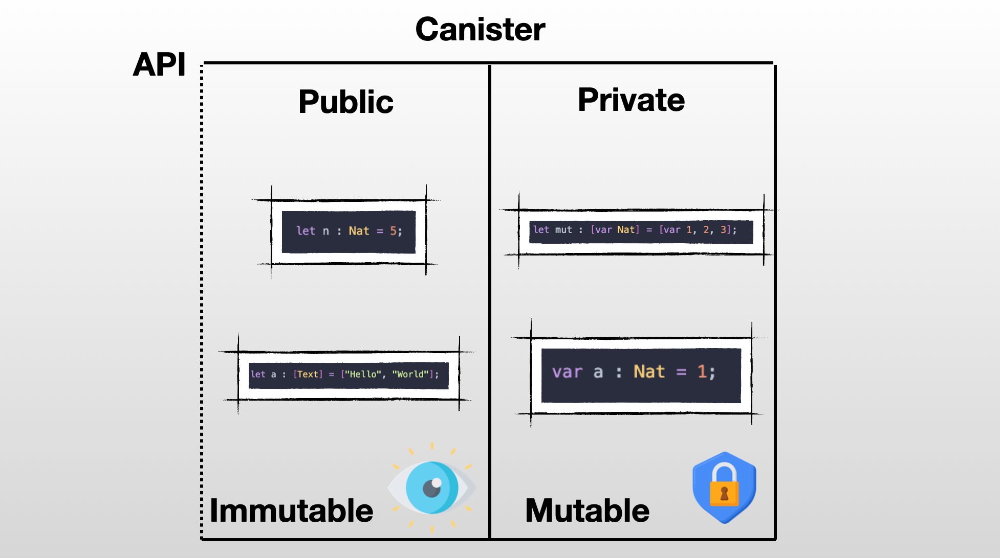

# Chapter 8: Advanced Types.
## ❓ Optional types
In Motoko, as in many other programming languages, there is a special value called `null` used to represent the absence of a result. This is helpful when indicating that a function returns nothing. The value `null` is of type `Null`, which only contains one value: `null`.

Consider an array of names called `names` and a function called `find_name` that takes a list of names as input and returns the index of the first occurrence of the name in the array. If the name is not found, the function should return `null` instead of an index. This way, the function indicates that it did not find the name without producing an error.

The following code is not valid in Motoko:
```motoko
let names : [Text] = ["Motoko", "Rust", "JavaScript", "TypeScript"];
public func find_name(name : Text) : async Nat {
    var index : Nat = 0;
    for(language in names.vals()){
        if (language == name){
            return index;
        };
        index +=1;
    };
    return null; // We haven't found any match so we return null.
};
````
Motoko throws an error because `null` is not of type `Nat`. To indicate that a function may return either a `Nat` value or `null`, we need a way to express that the function's return type can be one of two possibilities. The specific return value of the function depends on the input, which is unknown in advance, so we cannot predict if the function will return a `Nat` or `null` until it is executed.

We can use an optional type, `?T`, to express this. In our case, we would use `?Nat`. We can rewrite our code using this notation:
```motoko
let names : [Text] = ["Motoko", "Rust", "JavaScript", "TypeScript"];
public func find_name(name : Text) : async ?Nat {
    var index : Nat = 0;
    for(language in names.vals()){
        if (language == name){
            return ?index;
        };
        index +=1;
    };
    return null; // We haven't found any match so we return null.
};
```

The optional type, indicated by `?`, can be used with any other type, such as `?Text`, `?Int`, `?Bool`, and more.

Also, the optional type is often used with the `switch/case` pattern in Motoko. This pattern allows you to handle an optional value and execute different parts of your code depending on whether the input value is `null` or not. You can use the `switch/case` pattern to check if an optional value is present and perform different actions based on that, resulting in more elegant and safer code.
```motoko
public func handle_null_value(n : ?Nat) : async Text {
    switch(n) {
        // Check if n is null 
        case(null){
            return ("The argument is null"); 
        };
        case(? something){
            return ("The argument is : " # Nat.toText(something));
        };
    };
};
```
Lastly, the Base library provides an **Option** module for operating on optional values. For example, you can use the `Option.get()` function to unwrap an optional value with a default value:
```motoko
import Option "mo:base/Option";
actor {
    public func always_return_a_nat(n : ?Nat) : async Nat {
        return(Option.get(n, 0))
    };
}
```
This function takes a `?Nat` as input and returns a `Nat`. If you provide a `Nat` as input, it will return the same value. However, if you provide `null`, it will return the default value, set to 0.
## 👤 Generic Type
A generic type, usually written as `T`, allows you to write functions and code that can adapt to different types. When we talk about `T`, it refers to **whatever type you want**. This means that you can create a single function or class that can handle multiple types of inputs or data, without having to write separate code for each type.

Let's imagine that we have a task at hand - to determine if the size of an array is even or not. We're going to write a function called `isArrayEven` that takes an array as an input and returns a `Bool` value indicating whether the size of that array is even or not.
```motoko
public func isArrayEven(array : [Nat]) : async Bool {
    let size = array.size();
    if(size % 2 == 0){
        return true;
    } else {
        return false;
    };
};
```
This function works as intended, but is limited to arrays filled with `Nat`. So, what if we want to check the size of an array filled with `Text` or `Int`? <br>
One approach would be to create a separate function for each possible type: 
- `isArrayEvenNat`
- `isArrayEvenText`
- `isArrayEvenInt` 

As you can imagine, this quickly becomes hard to manage and maintain. A better solution is to utilize the power of generics. With generics, we can write a single function that works for any type of array. It's a more elegant and efficient way to solve the problem. So, let's embrace our new friend - generics - and make our code more dynamic and flexible!
```motoko
func isArrayEven<T>(array : [T]) : Bool {
    let size = array.size();
    if(size % 2 == 0){
        return true;
    } else {
        return false;
    };
};
```
Notice `<T>` following the name of the function. It means that this function now depends on the type of `T`. We need to specify the type of `T` when we want to use the function.
```motoko
let array : [Nat] = [1,2,3,4];
let bool : Boolean = isArrayEvent<Nat>(array); // Replace T with the actual type when you use the function. 
```

We've  already used generics when playing with `Buffer` & `Array` without talking about it. 
- The type `Buffer<T>` is a generic class and we need to provide a type when creating a new buffer.
    ```motoko
    let b = Buffer.Buffer<Nat>(2);
    ```

- `Array.append<T>` is a generic function and we need to provide the type of the elements of the arrays we are concatening.
    ```motoko
    let array1 = [1, 2, 3];
    let array2 = [4, 5, 6];
    Array.append<Nat>(array1, array2) // [1, 2, 3, 4, 5, 6];
    ```
## 🤫 Shared types
When information is sent to or received from an `actor` in Motoko, it uses specific data types called **shared types**. These **shared types** are used in `public` functions that can be accessed by other actors. So, **shared types** are the kinds of data that can be used as input or output for these public functions, allowing different actors to communicate with each other. <br/>

If we try to deploy [the following actor](https://m7sm4-2iaaa-aaaab-qabra-cai.ic0.app/?tag=2185064550):
```motoko
actor {
  var mutableArray : [var Nat] = [var 1, 3, 5, 7]; 

  public func showArray() : async [var Nat] {
    return mutableArray
  };
}
```
We will encounter the following error: `Error in file Main.mo:3:28 shared function has non-shared return type [var Nat] type [var Nat] is or contains non-shared type var Nat`.

A very important rule to remember: **every mutable state is always private to an actor.**

To put it short - anything that you can modify in your the state of your canister should be consider private and you won't be able to share it with other actors. <br/

<p align="center"> </p>
<p align="center"> If it's a var your can't share it outside!</p>


> For a complete overview of all the shared types, [refer to the Motoko Book](https://web3.motoko-book.dev/internet-computer-programming-concepts/async-data/shared-types.html?highlight=Shared%20types#shared-types).

## 🔃 Recursive types
Read [this section](https://web3.motoko-book.dev/advanced-types/recursive-types.html) of the Motoko Book.
